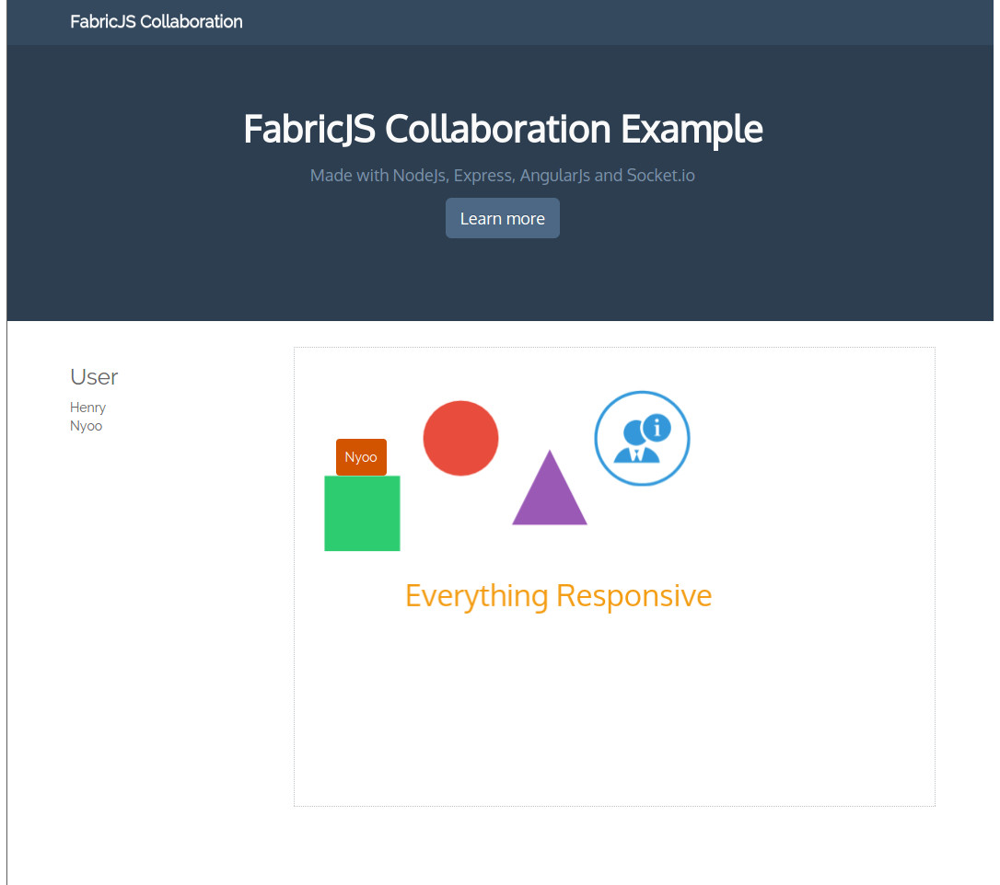

# FabricJS Collaboration Example

This is a proof-of-concept app I wrote using AngularJS + FabricJS + Socket.io + Express to test out collaboration possibilities with FabricJS.
It is a very Basic App with a limited feature set but is a good starting point for your own awesome Apps.

This Example shows you how to create a real time canvas, display the current User editing objects on it and techniques for some performance issues. Instead of sending position updates on every change I chose a more performance friendly method.

I also implemented some Responsive features, so this Example should run fine on mobile devices. I made the FabricJS canvas completely responsive. As said before, this is just proof-of-concept so a lot of features are missing and some parts could be not best practice.



## Live Demo
Live Demo is hosted on Heroku
[Live Demo](https://fabricjs-collaboration.herokuapp.com/)

## How to use it

Clone this repository and run the following shell commands afterwards:

```shell
npm install
```

```shell
bower install
```

### Running the app

Run the following shell commands:

```shell
node app.js
```

## Contact

For more information on AngularJS please check out http://angularjs.org/
For more on FabricJS and Socket.io, http://fabricjs.com/ and http://http://socket.io/ are
your friends.

If you want more example Apps regarding AngularJS and lots of other stuff you can visit my homepage:
http://www.henrykeller.eu

## License

    The MIT License (MIT)

    Copyright (c) 2015 Henry Keller <henry@inapp.eu>

    Permission is hereby granted, free of charge, to any person obtaining a copy
    of this software and associated documentation files (the "Software"), to deal
    in the Software without restriction, including without limitation the rights
    to use, copy, modify, merge, publish, distribute, sublicense, and/or sell
    copies of the Software, and to permit persons to whom the Software is
    furnished to do so, subject to the following conditions:

    The above copyright notice and this permission notice shall be included in
    all copies or substantial portions of the Software.

    THE SOFTWARE IS PROVIDED "AS IS", WITHOUT WARRANTY OF ANY KIND, EXPRESS OR
    IMPLIED, INCLUDING BUT NOT LIMITED TO THE WARRANTIES OF MERCHANTABILITY,
    FITNESS FOR A PARTICULAR PURPOSE AND NONINFRINGEMENT. IN NO EVENT SHALL THE
    AUTHORS OR COPYRIGHT HOLDERS BE LIABLE FOR ANY CLAIM, DAMAGES OR OTHER
    LIABILITY, WHETHER IN AN ACTION OF CONTRACT, TORT OR OTHERWISE, ARISING FROM,
    OUT OF OR IN CONNECTION WITH THE SOFTWARE OR THE USE OR OTHER DEALINGS IN
    THE SOFTWARE.


